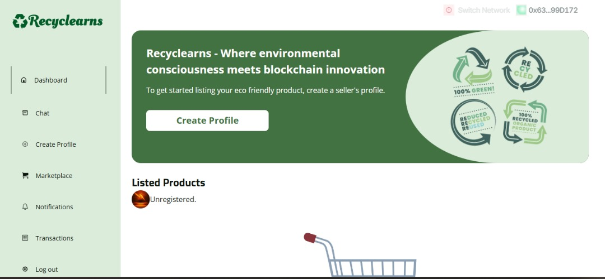

### Recyclearns

## Product Overview: 
Recyclearns is a decentralized marketplace application designed to incentivize and empower individuals, recyclable material sellers, recyclable centers, companies and other buyers to actively participate in sustainable waste management and recycling efforts. By leveraging blockchain technology, Recyclearns connects sellers offering recyclable materials with buyers in a transparent and rewarding ecosystem. Sellers list their recyclable materials/products while the buyers make purchases of these recyclable products using blockchain.

## Problem Statement:
Efficient waste management and recycling remain a significant challenge worldwide. Finding recyclable materials for purchase and motivating sellers to participate in recycling efforts are persistent issues. There is a lack of transparency and incentives to drive recycling participation effectively. These challenges hinder progress in mitigating climate change and achieving sustainable carbon reduction goals.

## Proposed Solution:
Recyclearns addresses these challenges by providing a decentralized marketplace for recyclable materials, bridging the gap between buyers and sellers of recyclable materials. The product leverages blockchain technology to revolutionize waste management and recycling, creating a solution that not only encourages participation but also promotes sustainability and environmental consciousness.

## Product Goals:
Enable users' product listing and purchases through the secure blockchain network.
Increase Recycling Participation: Encourage more sellers to participate in recycling efforts by connecting them with direct sellers of recyclable materials, hence more materials for their use.
Facilitate Secure Transactions: Ensure secure and transparent transactions through blockchain payments.

- 1

- 2

## Further Works
Enhance User Trust within the platform through user ratings, reviews, and transparent transactions.
Mobile App development.
Implementing the Green Token as incentives for the sellers and buyers to participate in GreenHouse Gas reduction.

## Deployed on aia chain
RecycleToken  deployed to 
Recyclearns  deployed to 

## Demo Video:

## MVP: 

## Pitch Slide: 
https://www.canva.com/design/DAGQXNFe94A/PIKmMVgIU1j5DlqFpFiAoA/view?utm_content=DAGQXNFe94A&utm_campaign=designshare&utm_medium=link&utm_source=editor

## Discord username: 
 
 @odegha

